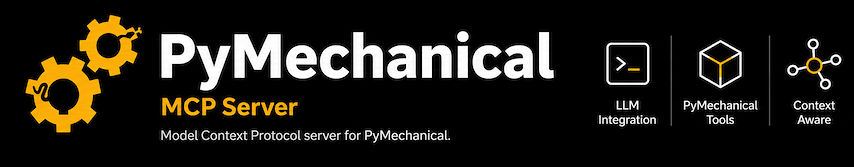

<p align="center">
  <picture>
    <source media="(prefers-color-scheme: dark)" srcset="doc/source/_static/pymechanical-mcp-transparent.png">
    <source media="(prefers-color-scheme: light)" srcset="doc/source/_static/pymechanical-mcp.png">
    
  </picture>
</p>

# PyMechanical-MCP

[](https://docs.pyansys.com/)
[](https://www.python.org/)
[](https://opensource.org/licenses/Apache-2.0)

PyMechanical-MCP provides a [Model Context Protocol (MCP)](https://modelcontextprotocol.io/)
server that enables AI assistants to interact with Ansys Mechanical through
[PyMechanical](https://mechanical.docs.pyansys.com/). Use natural language to set up,
solve, and postprocess structural, thermal, and multiphysics simulations.

## Overview

Key features:

- Manage Mechanical sessions by launching new instances or connecting to existing ones
- Run Mechanical scripting workflows through the Mechanical API
- Execute custom Python and PyMechanical code in a persistent session
- Export results, capture screenshots, and create custom plots
- Retrieve built-in guidance for common Mechanical workflow steps
- Work with local, remote, or containerized Mechanical deployments

<!-- Demo video will be added here once available -->

## Installation

### For users

Run PyMechanical-MCP directly with [`uvx`](https://docs.astral.sh/uv/):

```bash
uvx --index-strategy unsafe-best-match --from git+https://github.com/ansys/pymechanical-mcp ansys-mechanical-mcp
```

### For developers

```bash
git clone https://github.com/ansys/pymechanical-mcp.git
cd pymechanical-mcp
pip install -e ".[dev]"
```

## Usage

For step-by-step setup instructions for VS Code, Claude Code, Claude Desktop, and other
MCP-compatible clients, see the
[IDE and client configuration](https://mechanical-mcp.docs.pyansys.com/version/stable/getting_started/ide_configuration.html)
page in the documentation.

## License

This project is licensed under the Apache 2.0 license agreement. See the [LICENSE](./LICENSE)
file for details.

## Resources

- [PyMechanical-MCP documentation](https://mechanical-mcp.docs.pyansys.com)
- [PyMechanical documentation](https://mechanical.docs.pyansys.com/)
- [Model Context Protocol](https://modelcontextprotocol.io/)
- [Repository issues](https://github.com/ansys/pymechanical-mcp/issues)
- [Repository discussions](https://github.com/ansys/pymechanical-mcp/discussions)
