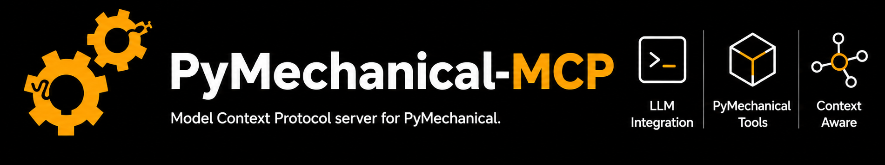

<p align="center">
  <picture>
    <source media="(prefers-color-scheme: dark)" srcset="doc/source/_static/pymechanical-mcp-dark.png">
    <source media="(prefers-color-scheme: light)" srcset="doc/source/_static/pymechanical-mcp-light.png">
    
  </picture>
</p>

[](https://docs.pyansys.com/)
[](https://www.python.org/)
[](https://opensource.org/licenses/Apache-2.0)

PyMechanical-MCP provides a [Model Context Protocol (MCP)](https://modelcontextprotocol.io/)
server that enables AI assistants to interact with Ansys Mechanical through
[PyMechanical](https://mechanical.docs.pyansys.com/). Use natural language to set up,
solve, and postprocess structural, thermal, and multiphysics simulations.

## Overview

Key features:

- Manage Mechanical sessions by launching new instances or connecting to existing ones
- Run Mechanical scripting workflows through the Mechanical API
- Execute custom Python and PyMechanical code in a persistent session
- Export results, capture screenshots, and create custom plots
- Retrieve built-in guidance for common Mechanical workflow steps
- Work with local, remote, or containerized Mechanical deployments

<!-- Demo video will be added here once available -->

## Tool surface

You can use 21 tools exposed by the server, grouped as follows:

| Group | Tools |
|-------|-------|
| Connection and lifecycle | `check_mechanical_status`, `check_mechanical_installed`, `launch_mechanical`, `connect_to_mechanical`, `disconnect_from_mechanical`, `list_mechanical_instances` |
| File and project management | `list_files`, `upload_file`, `download_file`, `clear_mechanical`, `save_project`, `open_project` |
| Mechanical scripting and solve | `run_python_script`, `solve_analysis`, `get_model_info`, `export_results` |
| Visualization and diagnostics | `screenshot`, `create_custom_plot`, `get_mechanical_logs` |
| Persistent Python execution | `run_python_code` |
| Workflow guidance | `get_guidelines_for` |

The server also exposes an MCP resource, `files://mechanical/working_directory`, that
returns the working directory of the connected Mechanical instance.

## Installation

### For users

Install the latest release with:

```bash
pip install ansys-mechanical-mcp
```

Or run directly without installing by using [`uvx`](https://docs.astral.sh/uv/):

```bash
uvx --index-strategy unsafe-best-match --from git+https://github.com/ansys/pymechanical-mcp ansys-mechanical-mcp
```

### For developers

```bash
git clone https://github.com/ansys/pymechanical-mcp.git
cd pymechanical-mcp
pip install -e ".[dev]"
```

## Usage

For step-by-step setup instructions for VS Code, Claude Code, Claude Desktop, and other
MCP-compatible clients, see
[IDE and client configuration](https://mechanical-mcp.docs.pyansys.com/version/stable/getting_started/ide_configuration.html)
in the documentation.

## Configuration

Use STDIO for local MCP clients. Use HTTP transport for remote access in trusted
networks or behind infrastructure that provides authentication and TLS.

Run with default STDIO transport:

```bash
ansys-mechanical-mcp
```

Run with HTTP transport:

```bash
ansys-mechanical-mcp --transport http --http-host 127.0.0.1 --http-port 8080
```

Common configuration options:

| Option | Description |
|--------|-------------|
| `--transport` | MCP transport type: `stdio` or `http` |
| `--ip`, `--port` | Mechanical connection target for `connect_on_startup` or defaults |
| `--connect-on-startup` | Connect to Mechanical when the MCP server starts |
| `--transport-mode` | gRPC mode: `auto`, `insecure`, `mtls`, `wnua` |
| `--certs-dir` | Directory containing mTLS certificates (`ca.crt`, `client.crt`, `client.key`) |
| `--cors-origins` | Comma-separated allowed origins for HTTP transport |

Environment variables:

| Variable | Description |
|----------|-------------|
| `PYMECHANICAL_TRANSPORT_MODE` | Default gRPC transport mode when `--transport-mode` is not set |
| `ANSYS_GRPC_CERTIFICATES` | Default certificate directory when `--certs-dir` is not set |
| `PYMECHANICAL_IP`, `PYMECHANICAL_PORT` | Docker connection defaults used by connection and discovery tools |

## License

This project is licensed under the Apache 2.0 license agreement. See the [LICENSE](./LICENSE)
file for details.

## Resources

- [PyMechanical-MCP documentation](https://mechanical-mcp.docs.pyansys.com)
- [PyMechanical documentation](https://mechanical.docs.pyansys.com/)
- [Model Context Protocol](https://modelcontextprotocol.io/)
- [Repository issues](https://github.com/ansys/pymechanical-mcp/issues)
- [Repository discussions](https://github.com/ansys/pymechanical-mcp/discussions)
